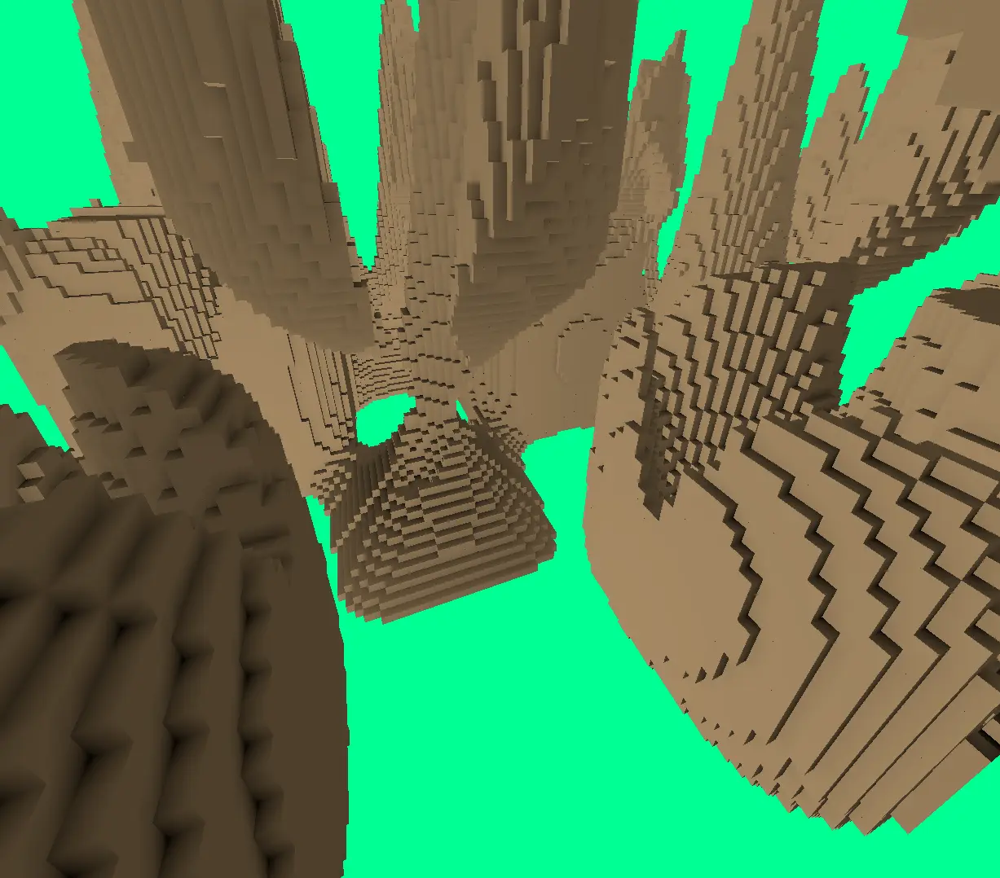

# WGPU Voxel Terrain

Voxel terrain generated by a compute shader & then rendered with ambient
occlusion on the GPU.
Run with `cargo run` and use the WASD keys to zoom and rotate the camera:

This is just a project to learn WGPU; it's not very useful, and the code could
do with a tidy!

# Overview

Here's roughly what this program does:

- Every frame, a [compute shader](./src/compute.wgsl) generates terrain as a giant array of voxels
- Voxels are culled by checking if they have all opaque neighbours
- Voxel data is used as the vertex buffer in the [vertex shader](./src/shader.wgsl)
- Render pass uses `DrawIndirect` to render voxels
    - `vertex_count: 36` sets 36 vertices per voxel, corresponding to the
      `6*2*3` vertices needed to make a cube from triangles
    - The number of visible voxels changes dynamically after culling, so it gets
      calculated and passed to the DrawIndirect call on each frame as
      `instance_count`.
- Fragment shader computes locations of each vertex by adding the triangle
  vertex offsets (stored as a constant array `TRI_VERTICES`) to the base voxel
  coords
- Final shading and ambient occlusion is calculated in `vs_main` of the vertex
  shader.

# Acknowledgements

Very helpful sources for learning:

- the [learn WGPU tutorial](https://sotrh.github.io/learn-wgpu/)
- gfx-rs [wgpu](https://github.com/gfx-rs/wgpu) (see examples)
